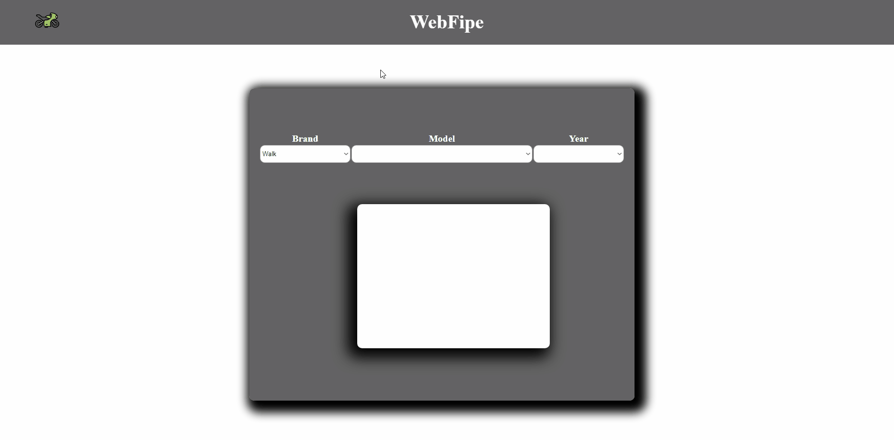

<h1 align="center">
FipeWeb
</h1>

This site is intended to show the user the search for a vehicle informing it of value, year, model, brand, etc. All according to the Tabel Fipe market.

##  📌 Languages

- ✔️ HTML

- ✔️ CSS

- ✔️ JavaScript

API used ☢️ https://parallelum.com.br/fipe/api/v1/carros/marcas